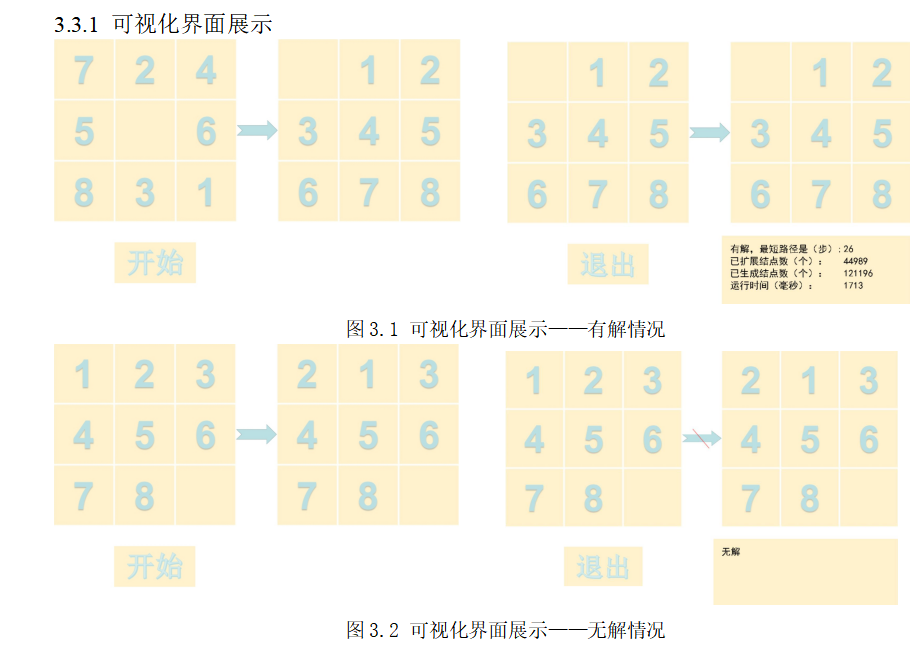
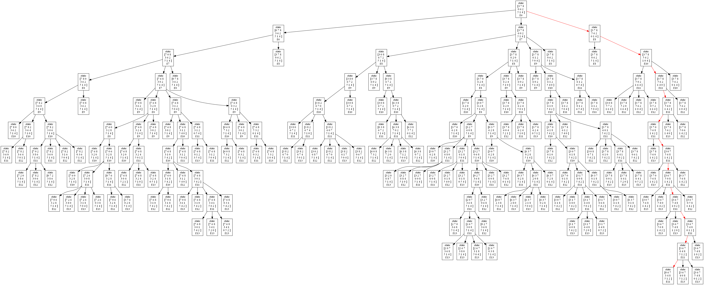

# Star_Puzzle——基于EasyX的八数码问题
实验以8数码问题为例，用C++语言实现了A*算法的求解程序，并设计两种不同的启发函数h(n)，其中h1(n)=不在位棋子数,h2(n)=所有棋子到其目标状态的距离。针对相同初始状态和目标状态，利用上述不同的启发式函数求得问题的解，并从运行时间、扩展结点数和生成结点数三个指标比较了它们对搜索算法性能的影响，得出启发式函数h2比h1性能更优，并得出了值越大的启发式函数在本身计算步花费较多时间的情况下性能更优的一般结论。
可视化方面，本实验用EasyX库了实现了显示初始状态，目标状态和中间搜索步骤。有一定的交互功能，搜索前用户可以输入初始状态和目标状态，选择要采用的启发式函数，点击开始即可开始展示最短路径，展示完成后程序还会给出本次搜索的用时、扩展结点数和生成结点数等评价指标。
同时，用dot语言画出搜索过程生成的搜索树，并在每个结点显示对应结点的状态和评价值f(n)，以红色标注出最终结果所选用的路线。

